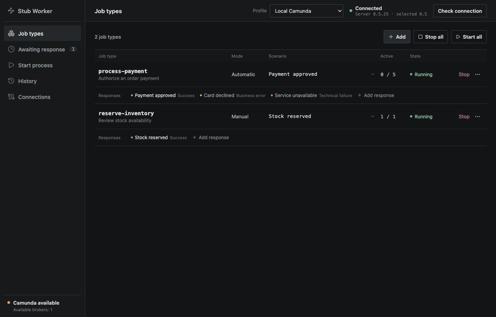
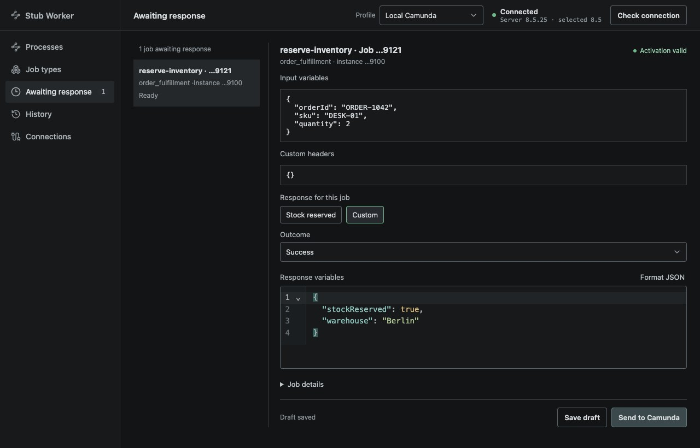
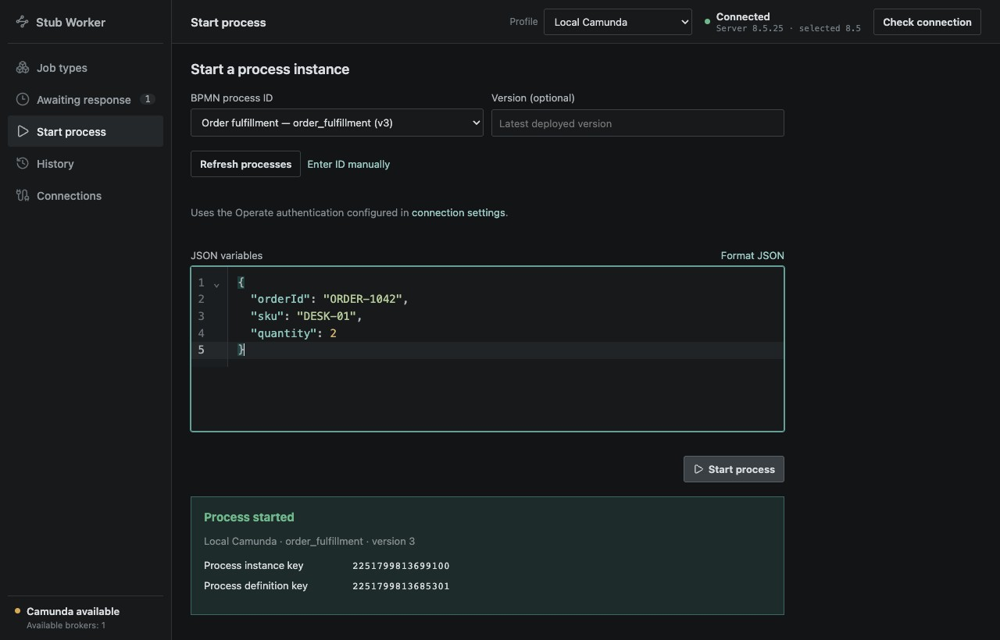
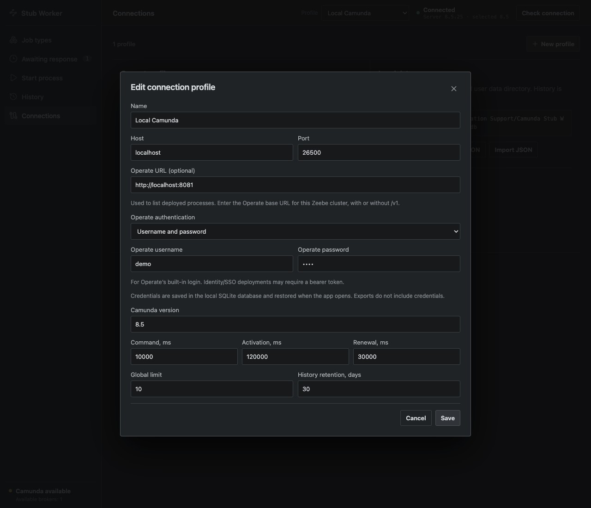

# Camunda Stub Worker

Camunda Stub Worker is a desktop app for testing Camunda 8 processes without building every external worker first. Connect to local Zeebe, start a deployed process, and choose how its jobs should respond. Connect Operate to pick deployed processes from a dropdown.

Use it to explore happy paths, business errors, and technical failures while developing or demonstrating a process. No code is required to create or switch responses.

[Download the latest release](https://github.com/mishankov/camunda-stub-worker/releases/latest)



## What you can do

- **Start deployed processes** with a BPMN process ID, optional version, and JSON variables.
- **Browse deployed processes** through the Operate API, with refresh and manual ID entry.
- **Stub multiple job types** from one desktop app.
- **Create reusable responses** for success, BPMN business errors, and technical failures.
- **Run automatically** with a selected response and optional delay.
- **Review jobs manually** before editing and sending a response.
- **Inspect input variables and custom headers** for activated jobs.
- **Search response history** by job key, process instance, job type, outcome, status, or date.
- **Switch between local Camunda profiles** and import or export their configuration as JSON.
- **Save Operate authentication** with each connection: username/password, bearer token, or no authentication.
- **Keep working offline** with local configuration and history stored in SQLite.

Camunda Stub Worker preserves JSON as text end to end. Large integers such as Zeebe keys do not pass through JavaScript `Number` or Go `float64`, so values larger than `2^53` remain intact.

## How it works

1. Add the exact job type used by a service task in your BPMN model.
2. Define one or more response scenarios for that job type.
3. Choose **Automatic** mode to respond with the active scenario, or **Manual** mode to review each job first.
4. Start the worker, then use **Start process** to create a process instance.
5. Review what happened in **History**, including every send attempt.

### Automatic mode

Automatic mode sends the active scenario as soon as a job is activated, after any delay configured on the scenario. It is useful for repeatable end-to-end flows, demos, and tests where the same response should be returned every time.

### Manual mode

Manual mode places activated jobs under **Awaiting response**. You can inspect the input, select a scenario, edit its local copy, and send the response when ready. The scenario's automatic delay is not applied in manual mode.



### Response scenarios

| Outcome | What Camunda Stub Worker sends | Typical use |
| --- | --- | --- |
| Success | Completes the job with JSON variables | Happy paths and alternate results |
| Business error | Throws a BPMN error with a code, message, and optional variables | Boundary error flows and expected business outcomes |
| Technical failure | Fails the job with a message, absolute remaining retry count, and retry backoff | Incidents, retries, and unavailable dependencies |

For a technical failure, `remainingRetries` is the absolute retry count sent to Zeebe. Reusing the same positive value may cause the job to be activated repeatedly.

## Install

Download the build for your operating system from the [latest GitHub release](https://github.com/mishankov/camunda-stub-worker/releases/latest). Release builds do not require Go or Node.js.

| Platform | Release package | Requirements |
| --- | --- | --- |
| Windows 10/11 x64 | ZIP archive | WebView2 Runtime |
| macOS 10.13+ x64 | DMG | Intel Mac |
| macOS 11+ arm64 | DMG | Apple silicon Mac |
| Linux x64 | `.tar.gz` archive | GTK3 and WebKit2GTK 4.1 |

Current artifacts are not publisher-signed or notarized. On macOS, open the DMG, drag **Camunda Stub Worker** to **Applications**, and remove the quarantine attribute before the first launch:

```bash
xattr -dr com.apple.quarantine "/Applications/Camunda Stub Worker.app"
```

## Quick start

1. Start a local Zeebe instance. You can use an existing installation or the bundled integration environment:

   ```bash
   docker compose -f integration/docker-compose.yml up -d
   ```

2. Open Camunda Stub Worker. On first launch it creates a **Local Camunda** profile for `localhost:26500` and Camunda `8.5`.
3. Select **Check connection**.
4. Add a job type that exactly matches the BPMN `zeebe:taskDefinition type`. Job types are case-sensitive.
5. Add at least one response scenario.
6. For an automatic worker, select its active scenario.
7. Deploy your BPMN model with Camunda Modeler or `zbctl`, start the job type, then open **Start process**. Enter its BPMN process ID and JSON variables, leave version blank for the latest deployment, and select **Start process**.

### Start a process

Open **Start process**, below **Awaiting response** in the sidebar. Choose a deployed process from Operate, or select **Enter ID manually**. Leave **Version** blank for the latest deployed version, or enter a specific version. Add your input variables as a JSON object and select **Start process**.



Screenshots show the current app UI with illustrative sample data.

The app shows the confirmed process instance key and definition key. It returns once the instance is created, without waiting for the process to finish. On an uncertain result (such as a timeout), check Camunda before trying again: an instance may already exist. Process starts are not retried automatically or saved in response History; History records jobs handled by the workers. BPMN deployment still requires an external tool.

### Connect Operate

1. Open **Connections → Edit profile** and set the **Operate URL**, with or without `/v1`. Operate and Zeebe must point to the same cluster.
2. Choose **Username and password**, **Bearer token**, or **None** under **Operate authentication** and enter the corresponding credentials.
3. Save the profile, then open **Start process**. Use **Refresh processes** to load new deployments.



New local connections default to `http://localhost:8081` with username `demo` and password `demo`. Adjust these to match your installation. Built-in Operate login uses a session cookie; Identity/SSO deployments may require a bearer token. Authentication is saved per connection and restored after restarting the app.

The picker lists default-tenant processes and combines their versions into one entry per BPMN process ID. Recently deployed models may take a moment to appear in Operate. If Operate is unavailable, manual ID entry still works. The bundled Docker environment contains only Zeebe; Operate is optional and must be provided separately.

## Compatibility and scope

The verified server target is **Zeebe 8.5.25**. Selecting **Other 8.x** uses the 8.5 API mode and does not imply verified compatibility.

The Zeebe connection uses plaintext gRPC with an explicit `host:port`; Zeebe OAuth, TLS, Camunda SaaS, and multitenancy are not supported. The optional Operate connection uses the v1 REST API over HTTP or HTTPS with built-in login, bearer-token authentication, or no authentication. Conditional scenarios, scripts, BPMN deployment, and unattended update installation are outside the app's scope.

Other workers registered for the same job type compete for jobs, so exclusive activation is not guaranteed. Zeebe does not provide an ownership token for a specific activation, which means exactly-once handling cannot be guaranteed.

A topology check confirms that the server is reachable; it does not prove support for every operation. If the required `UpdateJobTimeout` operation returns `UNIMPLEMENTED`, the app stops new activations.

## Local data and privacy

Configuration and history stay on your computer in a SQLite database. Operate usernames, passwords, and bearer tokens are stored in plaintext in the local SQLite database. Profile exports and activation snapshots omit these credentials. Exported profiles contain profiles, job types, and scenarios, but exclude history and runtime state.

Imported profiles receive new IDs, so they do not overwrite an existing profile.

The exact database path appears under **Connections**. The default directory is:

- macOS: `~/Library/Application Support/Camunda Stub Worker/`
- Windows: `%AppData%\Camunda Stub Worker\`
- Linux: `$XDG_CONFIG_HOME/Camunda Stub Worker/` or `~/.config/Camunda Stub Worker/`

## Reliability behavior

The worker reserves capacity before requesting jobs and enforces both global and per-job-type activation limits. While a job waits for manual input or an automatic delay, the app renews its timeout with `UpdateJobTimeout`.

Each activation and an immutable snapshot of its selected scenario are persisted before a response command is sent. If a network break, deadline, or shutdown happens after a command may have been transmitted, the result is marked **unknown** and is not retried automatically. On restart, active jobs become **interrupted** and in-progress sends become **unknown**.

The database uses SQLite WAL mode and foreign keys. Completed history is cleaned up according to the configured retention period, and a single-instance lock prevents two copies from using the same database at once.

## Development

### Promo site

The standalone promo site lives in `site/`. It uses plain HTML and CSS and does not require the desktop app or a build step.

Preview it locally from the repository root:

```bash
python3 -m http.server 4173 --directory site
```

Open <http://localhost:4173>. Screenshots in `site/assets/` are copies of the documentation images in `docs/images/`; refresh both sets together. Use sample data and masked credentials when capturing the UI.

For deployment, select **GitHub Actions** in the repository's **Settings → Pages → Build and deployment → Source**. After these changes are pushed to `main`, `.github/workflows/pages.yml` publishes only `site/` to GitHub Pages when site files change. The workflow can also be run manually on `main`. The expected project URL is <https://mishankov.github.io/camunda-stub-worker/>. All local asset URLs are relative so the site works under the repository path.

### Stack

Dependencies are pinned in `go.mod` and `frontend/package-lock.json`:

- Go **1.25.0**
- Wails **2.15.0**
- Svelte **5.57.0**, Vite **8.3.0**, and TypeScript **5.9.2**
- Camunda Go client / Zeebe protocol **8.5.25**
- `modernc.org/sqlite` **1.39.1** (pure Go; no system SQLite dependency)

The UI uses CodeMirror for JSON editing, syntax highlighting, and validation. Update checks run in the background against published GitHub Releases and display an in-app download notification when a newer version is available.

### Run locally

Development requires the platform dependencies listed in the [Wails installation guide](https://wails.io/docs/gettingstarted/installation/), plus Go and Node.js.

```bash
go install github.com/wailsapp/wails/v2/cmd/wails@v2.15.0
cd frontend && npm ci && cd ..
wails dev
```

### Checks

```bash
go test -race ./...
cd frontend && npm run check && npm run build
```

### Production builds

```bash
# macOS (the wrapper links the framework required by file dialogs)
wails build -clean -compiler ./scripts/go-wails-macos.sh

# Windows x64
wails build -clean -platform windows/amd64 -webview2 download

# Linux x64, WebKit2GTK 4.1
wails build -clean -platform linux/amd64 -tags webkit2_41
```

The macOS application is written to `build/bin`. Release builds package it in a DMG with a custom volume icon and a drag-to-Applications layout. A Windows installer can be built with `-nsis` when NSIS is installed. The build workflow runs each platform build on a native CI runner.

## Integration environment

Start the bundled Zeebe 8.5.25 environment:

```bash
docker compose -f integration/docker-compose.yml up -d
docker compose -f integration/docker-compose.yml logs -f zeebe
```

The sample models in `integration/bpmn/` cover each response type:

- `success.bpmn` — job type `stub-success`
- `business-error.bpmn` — job type `stub-business-error`, boundary error code `BUSINESS_ERROR`
- `technical-failure.bpmn` — job type `stub-technical-failure` with three initial retries

Deploy the models with Camunda Modeler, `zbctl`, or another external tool. Start instances from **Start process** using `stub_success_process`, `stub_business_error_process`, or `stub_technical_failure_process`.

## Verification

- `go test -race ./...` passes on macOS arm64.
- `npm run check` and the production frontend build pass.
- A Wails 2.15.0 macOS arm64 `.app` builds and receives an ad-hoc signature.
- `go test -tags integration -run TestZeebe825Smoke -v ./integration` passes against Zeebe 8.5.25. It covers all three bundled models, a success result containing `9007199254740993`, a business error, `FailJob`, and `UpdateJobTimeout`.
- Windows x64, macOS x64, and Linux x64 builds are delegated to native CI runners and have not been executed locally in this environment.
